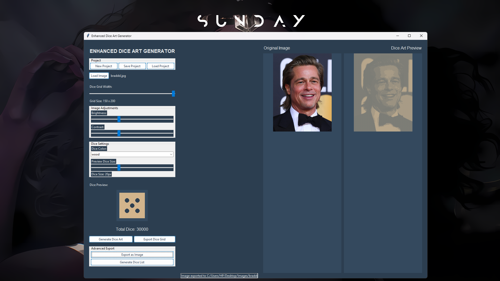

# Dice-Art-Generator
A sophisticated Python application that converts images into dice art mosaics. 

 

A Python application that converts images into artistic representations using dice values.

### As a Web App:
1. Visit [https://hhhpraise.github.io/Dice-Art-Generator/](https://hhhpraise.github.io/Dice-Art-Generator/)
2. Add to home screen (mobile) or bookmark (desktop)
## Features

- Convert any image into a dice art mosaic
- Adjustable grid size (10-150 dice wide)
- Multiple dice color schemes
- Brightness and contrast controls
- Real-time preview
- Export options:
  - Text grid of dice values
  - Image of dice art
  - Detailed dice requirement list
- Project saving/loading

## Requirements

- Python 3.6+
- Pillow (PIL) library
- Tkinter (usually included with Python)

### How to Use:
1. Load an image file (JPG, PNG, etc.)
2. Adjust settings:
   - Dice grid width
   - Dice color
   - Brightness/contrast
3. Click "Generate Dice Art"
4. Export your creation in your preferred format

## Contributing

Contributions are welcome! Please open an issue or pull request for any improvements.

## License

MIT License - see LICENSE file for details
